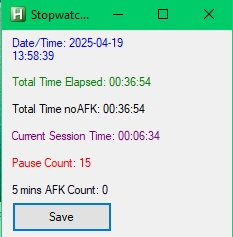

Note:
- This can be useful to monitor working staff that must be on an desktop App. 
- Also can use as monitoring your gaming effective time, etc.

Pre requirement:
- Windows 7,10 OS maybe 11 also can.
- Autohotkey v2/v1 installed. you can try which one worked best.

Usage: copy the script, and right click on the file -> run script.

Feature:
- The timer only tickin if the target window is active/has focus.
- Save the log on csv file on same directory of the script.
- New app restart will resume the count (2 variable) if current date = date of last line log.
- auto save logging every hour (can change frequency on source code).

It will visualize 5 stats and also auto logging every 1 hours:
- Total time of target app window active/focus.
- Total time of target app window active/focus, without afk more than 5 minutes.
- Current session time (without loses focus).
- Pause count (change window / loses focus count).
- 5 mins AFK count with window always still focus.

ToDo:
- can graph because has csv log.
- can connect to database via backend, odbc etc.
- can connect to backend, for many usage like more logic, trigger alert etc.
- can make it always open, can't be closed (for monitoring in working staff, or parental).
- may usage and add functionality.
- can trigger lockout if time if more than x.
- can monitor multiple app.
- can make it stealth (to monitoring worker, kids etc).
